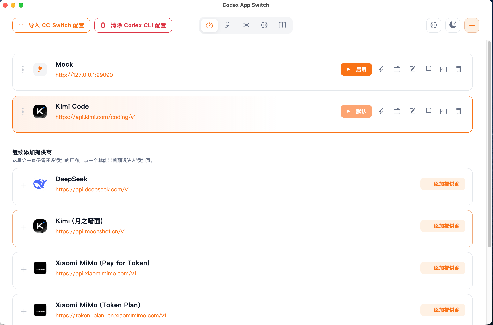
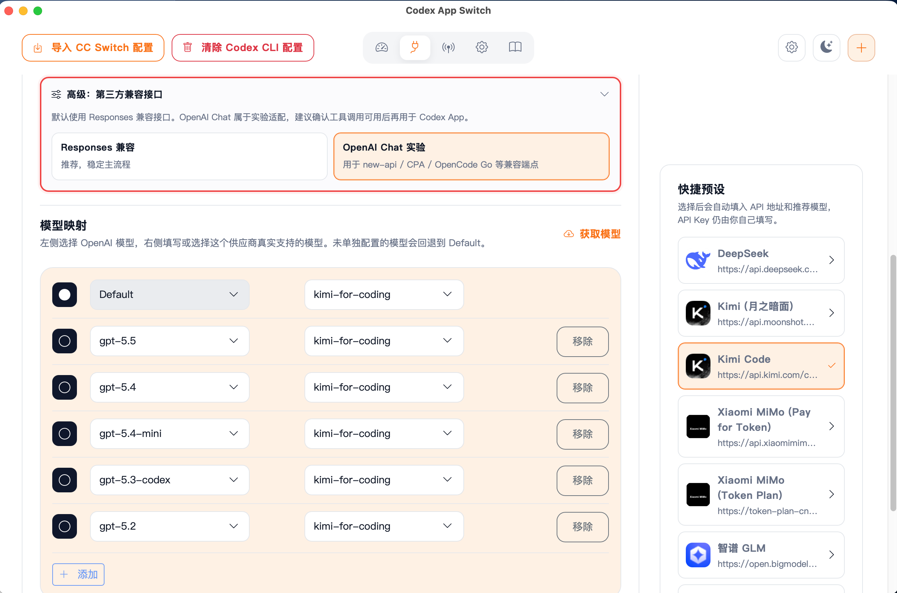
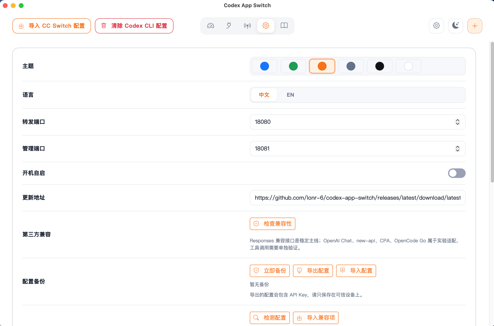
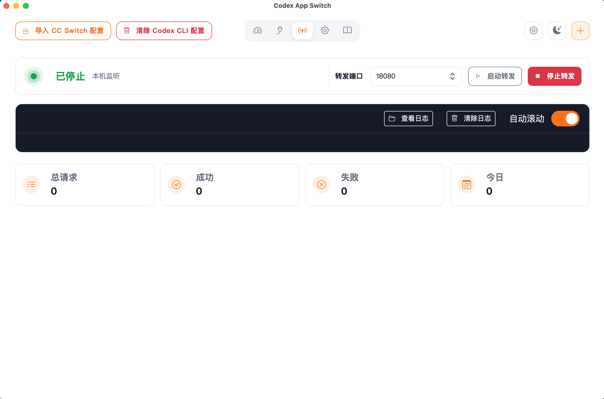

# Codex App Transfer

[](https://github.com/Cmochance/codex-app-transfer/stargazers)
[](LICENSE.txt)
[](https://www.python.org/)
[](https://github.com/Cmochance/codex-app-transfer/releases)

Codex App Transfer 是一个面向 **OpenAI Codex CLI** 的轻量配置和转发工具。它在本机起一个网关，把 Codex CLI 发出的 Responses API（含 WebSocket 流和 `/responses` HTTP 回退）翻译成 Chat Completions 格式，再转发到你选择的供应商，比如 Kimi Code、Kimi 月之暗面、DeepSeek V4、Xiaomi MiMo、智谱 GLM、阿里云百炼等。

和 `farion1231/cc-switch` 这类偏 Claude Code / CLI 的 Anthropic 工具不同，本项目专注 OpenAI Codex CLI 的接入：用桌面界面管理供应商、模型映射、转发端口和日志，让 Codex CLI 可以无缝使用第三方 OpenAI 兼容的推理服务。

Windows 安装版和便携版默认会打开独立桌面窗口；浏览器地址只作为调试和备用入口。点击窗口关闭按钮时，应用会缩小到系统托盘继续运行；需要完全退出时，请右键托盘图标选择"退出"。

启动转发后，Codex CLI 通过本机 `127.0.0.1:18080` 与本工具通信。本工具在转换协议、改写模型名、保留 `previous_response_id` 历史的同时，把上游真实错误体写到日志面板，方便排查兼容问题。

## 项目状态

- 当前版本：v1.0.4
- 已验证供应商：Kimi Code（`kimi-for-coding` UA 网关）、Kimi 月之暗面（Moonshot Platform）、DeepSeek V4（含「Max 思维」思考模式）、Xiaomi MiMo (Token Plan)、Xiaomi MiMo (Pay for Token)
- 实验兼容：智谱 GLM / 阿里云百炼 / 其它 OpenAI Chat 兼容反代
- 平台：Windows x64 安装版 / Windows 便携版 / macOS arm64 / Linux x86_64

### 更新日志

逐版本变更详见 [GitHub Releases](https://github.com/Cmochance/codex-app-transfer/releases) 或 `docs/release-notes-v*.md`。

## 能做什么

- 管理多套供应商，按 OpenAI 模型名（gpt-5.5 / gpt-5.4 / gpt-5.4-mini / gpt-5.3-codex / gpt-5.2）映射到供应商真实模型 ID。
- 把 Codex CLI 的 Responses API 流式 / 非流式请求转换为 Chat Completions 格式后转发，多轮工具对话上下文 + 思维内容流式展开均已对齐 OpenAI Responses API 协议。
- 兼容 Codex CLI 0.126+ 的 `responses_websocket` 主连接和 `responses_http` HTTP 回退（含 `/responses` 路由别名）。
- 自动把上游 `chatcmpl-...` 应答 ID 重写成 Codex CLI 校验通过的 `resp_...`，并保留 deployment affinity 编码；session_cache 查询前自动 decode 回原始 ID。
- thinking 开启的上游（Kimi / DeepSeek 等）三层防御：单空格占位 `reasoning_content`、`reasoning_summary_part` 标准协议事件、全局 `TOOL_CALLS_CACHE` 在历史压缩后重建缺失的 assistant.tool_calls。
- 自动归一化 `reasoning_effort`（`xhigh` / `max` → `high`，`auto` / `none` 直接丢弃），适配只接受 `minimal/low/medium/high` 的供应商。
- Codex CLI 原配置守护：apply 前自动快照 `~/.codex/{config.toml,auth.json}`，退出 / 下次启动按 key 智能合并还原；切到不需转发的 provider 自动停转发服务。
- 实时日志面板：每 2 秒自动刷新；提供"查看日志"按钮直接打开 `~/.codex-app-transfer/logs/`；"清除日志"按钮会把当前日志备份到 `logs/backup/` 后开启新日志，不直接删除文件。
- 中文 / 英文界面，浅色 / 深色 / 绿色 / 橙色 / 灰色 / 白色多种主题（仅深色会改变背景色）。
- Windows / macOS / Linux 系统托盘 + 跨平台单实例锁定(双击启动会自动唤起已有窗口)。

## 界面预览

| 仪表盘 | 供应商 |
|---|---|
|  |  |
| **设置** | **日志** |
|  |  |

## 下载

最新已发布版本在 GitHub Release：

```text
https://github.com/Cmochance/codex-app-transfer/releases/latest
```

推荐普通用户下载：

- `Codex-App-Transfer-v<版本>-Windows-Setup.exe`：Windows 安装版（推荐）
- `Codex-App-Transfer-v<版本>-Windows-Portable.zip`：Windows 便携版（解压即用）
- `Codex-App-Transfer-v<版本>-macOS-arm64.dmg`：macOS Apple Silicon 拖拽安装
- `Codex-App-Transfer-v<版本>-macOS-arm64.pkg`：macOS Apple Silicon PKG，安装到 `/Applications/Codex App Transfer.app`
- `Codex-App-Transfer-v<版本>-Linux-x86_64.tar.gz`：Linux x86_64 便携 tar 包（解压即用，需系统已装 GTK3 + WebKit2GTK 4.0 + libayatana-appindicator3）
- `Codex-App-Transfer-v<版本>-Linux-x86_64`：Linux x86_64 单文件便携可执行程序

每个二进制都附带 `.sha256` 和 `.sig`（基于 `release/Codex-App-Transfer-release-public.pem` 的 RSA-3072 PKCS#1 v1.5 + SHA-256 签名）。`release/latest.json` 是版本元数据，供应用内"检查更新"读取。

Windows 版目前还没有 Authenticode 代码签名证书，系统可能提示未知发布者；可用 `.sha256` / `.sig` 校验下载完整性。

如果这个工具对你有帮助，欢迎 Star 一下不迷路。遇到问题、想新增供应商支持，或想反馈兼容性 issue，可直接发到 [Issues](https://github.com/Cmochance/codex-app-transfer/issues)。

## 基本用法

1. 启动 Codex App Transfer，弹出桌面窗口。
2. 在仪表盘点右上角加号 → 选择预设或自定义供应商，填入 API Base URL、API Key、模型映射。
3. 在"转发"页面点"启动转发"，本机 `18080` 端口开始监听。
4. 在 Codex CLI 配置文件（`~/.codex/config.toml`）里把 `base_url` 指向 `http://127.0.0.1:18080`，把 API Key 设为本工具显示的 Gateway API Key。
5. 重新打开 Codex CLI，模型选项就会自动列出当前供应商的模型映射。

如果桌面窗口无法打开，可以手动访问备用地址：

```text
http://127.0.0.1:18081
```

## English Quick Start

Codex App Transfer is a lightweight desktop app that turns OpenAI Codex CLI into a multi-provider client. It runs a local gateway, translating Codex CLI's Responses API requests (WebSocket stream + `/responses` HTTP fallback) into Chat Completions format and forwarding them to providers such as Kimi Code, Kimi Moonshot, DeepSeek V4, Xiaomi MiMo, Zhipu GLM, and Alibaba Cloud Bailian.

Unlike `farion1231/cc-switch` and similar Anthropic-oriented Claude Code tools, this project focuses on OpenAI Codex CLI: manage providers, model mapping, forwarding ports, and logs from a desktop UI so Codex CLI can talk to any third-party OpenAI-compatible inference endpoint.

The Windows installer / portable build opens a standalone desktop window by default; the local browser URL is only a debug fallback. Closing the window minimizes the app to the system tray; right-click the tray icon and choose "Exit" to fully quit.

### Project status

- Current version: v1.0.4
- Validated upstream: Kimi Code (`kimi-for-coding` UA gateway), Kimi Moonshot (Platform API), DeepSeek V4 (with "Max thinking" mode), Xiaomi MiMo (Token Plan), Xiaomi MiMo (Pay for Token)
- Experimental compatibility: Zhipu GLM / Alibaba Cloud Bailian / other OpenAI Chat-compatible reverse proxies
- Platforms: Windows x64 installer / Windows portable / macOS arm64 / Linux x86_64

### Changelog

Per-version changes are tracked at [GitHub Releases](https://github.com/Cmochance/codex-app-transfer/releases) (and locally under `docs/release-notes-v*.md`).

### Getting started

1. Download the latest installer or portable package from [GitHub Releases](https://github.com/Cmochance/codex-app-transfer/releases/latest).
2. Open Codex App Transfer — a desktop window appears.
3. On the dashboard click the top-right `+` and pick a preset (or define a custom provider). Fill in the API base URL, API key, and model mappings.
4. Open the **Proxy** page and click `Start forwarding` — the app listens on `127.0.0.1:18080`.
5. In Codex CLI's config (`~/.codex/config.toml`), point `base_url` at `http://127.0.0.1:18080` and set the API key to the gateway API key shown in the app.
6. Restart Codex CLI; the model picker now lists the model mappings for the active provider.

If the desktop window fails to open, the management UI is also reachable at `http://127.0.0.1:18081`.

### What it does

- Manages multiple providers and maps OpenAI model names (`gpt-5.5`, `gpt-5.4`, `gpt-5.4-mini`, `gpt-5.3-codex`, `gpt-5.2`) to each provider's real model ID.
- Translates Codex CLI's Responses API requests (streaming and non-streaming) to Chat Completions format before forwarding.
- Compatible with the Codex CLI 0.126+ transport: `responses_websocket` primary connection plus `responses_http` HTTP fallback, including the `/responses` route alias (no `/v1/` prefix).
- Re-encodes upstream `chatcmpl-*` IDs into Codex-friendly `resp_<base64>` while preserving deployment affinity, so `previous_response_id` keeps working.
- For thinking-enabled upstreams (Kimi / DeepSeek), automatically attaches `reasoning_content` to historical assistant tool-call messages to avoid `400 thinking is enabled but reasoning_content is missing`.
- Normalizes `reasoning_effort` (`xhigh` / `max` → `high`; `auto` / `none` dropped) so providers that only accept `minimal/low/medium/high` won't reject the request.
- Live log panel auto-refreshing every 2 seconds, with an `Open log folder` button that jumps to `~/.codex-app-transfer/logs/`. The `Clear logs` button archives the active log to `logs/backup/` with a timestamp suffix instead of deleting it.
- Chinese / English UI with light, dark, green, orange, gray, and white themes (only the dark theme changes background colors).
- System tray on Windows / macOS / Linux + cross-platform single-instance lock (a second launch auto-focuses the existing window).

### Security notes

- Provider API keys are stored only in `~/.codex-app-transfer/config.json` — do not upload it together with `logs/` to a public repo.
- The forwarding service binds to `127.0.0.1` only and never hijacks the system proxy. Management API endpoints require an `x-cas-request: 1` header so generic web pages can't trigger local writes via cross-site requests.
- Backup / export JSON files contain plaintext API keys — keep them on trusted devices only.
- Logs append to `~/.codex-app-transfer/logs/proxy-YYYY-MM-DD.log`. Clearing logs archives them to `logs/backup/` with a timestamp suffix (no deletion).
- Windows builds are not Authenticode-signed yet; verify downloads with the published `.sha256` / `.sig` (run `scripts/Test-ReleaseSignature.ps1 -File <asset>`).
- This project is not affiliated with OpenAI, Anthropic, CC-Switch, or `farion1231/cc-switch`.

## 默认端口

- 管理界面：`18081`
- 本机转发服务：`18080`，Codex CLI 通过它访问上游供应商

可在 设置 → 端口 修改，修改后需要重启转发。

## 本地开发

```powershell
git clone https://github.com/Cmochance/codex-app-transfer.git
cd codex-app-transfer
pip install -r requirements.txt
python main.py
```

默认会打开桌面窗口。调试时也可以用浏览器模式：

```powershell
python main.py --browser
```

## 验证

```powershell
python -m compileall -q backend main.py
node --check frontend/js/api.js
node --check frontend/js/app.js
node --check frontend/js/i18n.js
```

## 打包

构建跑在 Mac 本机 + Docker 容器里。三平台一键发布：

```bash
make release VERSION=1.0.0
```

依次执行 `mac-release` → `linux-release` → `win-release`，最后汇总 `latest.json`。
每个产物在 `release/` 下都附带 `.sha256` 和 `.sig`（RSA-3072 PKCS#1 v1.5 + SHA-256，
公钥 `Codex-App-Transfer-release-public.pem`）。

### macOS（在 macOS 本机）

```bash
make mac-release VERSION=1.0.0
```

产物：`dist/mac/Codex App Transfer.app`、`Codex-App-Transfer-v<版本>-macOS-arm64.{pkg,dmg}`。
设置 `MACOS_CODESIGN_IDENTITY` 启用 Apple Developer ID 签名；不设则仅本机自签。

### Linux x86_64（macOS 上跨编译，需要 Docker）

```bash
make linux-release VERSION=1.0.0
```

容器基于 `ubuntu:22.04`，预装 GTK3 + WebKit2GTK 4.0 + libayatana-appindicator3，
PyInstaller 同时出 folder 模式（打成 tar.gz 便携包）和 onefile 模式（单文件可执行）。
运行时仍依赖目标系统已装上述系统库。

### Windows（macOS 上跨编译，需要 Docker）

```bash
make win-release VERSION=1.0.0
```

容器基于 `tobix/pywine:3.12` + Linux NSIS，Wine 跑 PyInstaller 出 Windows 原生 exe，
再用 `makensis` 出 Setup。详细原理、踩坑提示和 Authenticode 签名的回退方案见
[`docs/build.md`](docs/build.md)。

> ⚠️ PyInstaller-via-Wine 偶尔在 pywebview / pystray 上有兼容问题，
> **正式发布前请在真实 Windows 机器上烟雾测试** Setup 安装、单文件 exe 启动、托盘交互。

### Docker / OrbStack 准备

Apple Silicon 推荐安装 [OrbStack](https://orbstack.dev/)，比 Docker Desktop 轻量。
首次启动 OrbStack 后建议把 `~/.orbstack/bin` 加进 PATH（脚本里有 fallback，PATH 没配也能跑）。
首次跑 `linux-image` / `win-image` 会拉 ~3 GB 基础镜像，之后增量构建很快。

### Windows 本地原生打包（备用路径）

手头有 Windows 机器时：

```powershell
build.bat                 # 交互式选 1/2/3/4
# 或：
powershell -NoProfile -ExecutionPolicy Bypass -File scripts\New-Release.ps1 `
    -Version 1.0.0 -Build -TryInstaller `
    -Repository Cmochance/codex-app-transfer
python scripts\release_assets.py --version 1.0.3 --include windows
```

带代码签名证书时再加 `-CodeSign -CodeSigningCertificateBase64 ...`，参见 `scripts/Invoke-CodeSigning.ps1`。

### 签名校验

```powershell
powershell -NoProfile -ExecutionPolicy Bypass -File scripts\Test-ReleaseSignature.ps1 `
    -File release\Codex-App-Transfer-v1.0.3-Windows-Setup.exe
```

或在任意有 Python + cryptography 的环境里：

```bash
.venv/bin/python -c "
from pathlib import Path
import base64
from cryptography.hazmat.primitives import hashes, serialization
from cryptography.hazmat.primitives.asymmetric import padding
pub = serialization.load_pem_public_key(Path('release/Codex-App-Transfer-release-public.pem').read_bytes())
asset = 'release/Codex-App-Transfer-v1.0.3-Linux-x86_64.tar.gz'
sig = base64.b64decode(Path(asset+'.sig').read_text())
pub.verify(sig, Path(asset).read_bytes(), padding.PKCS1v15(), hashes.SHA256())
print('OK')
"
```

## Troubleshooting

### Codex CLI 提示 `404 Not Found url: http://127.0.0.1:18080/responses`

老版本只有 `/v1/responses`，Codex CLI 0.126 起会回退到 `/responses`（不带 `/v1/`）。本工具已加路由别名，更新到 v1.0.1+ 即可。

### Codex CLI 提示 `stream disconnected before completion`

通常是 `response.id` / `response.model` 没有按 Codex CLI 期望填回。本工具会把上游 `chatcmpl-...` 重写成 `resp_<base64>` 并保留请求模型名，请确认转发日志中确实看到了 `resp_...` 而不是 `chatcmpl-...`。

### 上游 400：`thinking is enabled but reasoning_content is missing in assistant tool call message`

Kimi / DeepSeek 在开启 thinking 后强制要求历史中带 tool_call 的 assistant 消息提供 `reasoning_content`。v1.0.1 已自动补默认空字符串，并把 Responses 输入里的 reasoning items 映射到对应 assistant 消息。如果仍出现，请抓一份转发日志反馈。

### 上游 400：`'reasoning_effort' does not support 'xhigh'`

Codex 用户配置里若把 `model_reasoning_effort` 设成 `xhigh` / `max`，本工具会自动降级到 `high`。`auto` / `none` 等 Chat 端不接受的值会被丢弃。

### 端口冲突

本工具默认监听 `18080`（转发）+ `18081`（管理）。如果端口被占：

```powershell
netstat -ano | findstr :18080
netstat -ano | findstr :18081
```

发现占用后，可以关闭占用进程，或在 设置 → 端口 改成空闲端口后重启转发。

### Windows 提示未知发布者

当前 Windows 构建还没有 Authenticode 代码签名证书，所以 Windows 可能提示未知发布者。Release 页面提供 `.sha256` 和 `.sig`，可用于校验安装包没有被替换。

### 日志去哪了

- 应用界面：转发页面下方实时面板，每 2 秒自动刷新。
- 磁盘文件：`~/.codex-app-transfer/logs/proxy-YYYY-MM-DD.log`，可点"查看日志"按钮直接打开。
- 清除日志：把当前日志移到 `logs/backup/` 并加时间戳后缀，不直接删除。

## 技术栈

- 后端：Python 3.11+, FastAPI, httpx, uvicorn, websockets
- 前端：HTML, CSS, Vanilla JavaScript, Bootstrap 5.3 CDN
- 桌面壳：pywebview（Windows EdgeWebView2 / macOS WKWebView）+ pystray
- 存储：`~/.codex-app-transfer/config.json`（配置）、`~/.codex-app-transfer/logs/`（日志）
- 打包：PyInstaller, NSIS, hdiutil（macOS）
- 跨平台构建：Docker + Wine（macOS 上跨编译 Windows）+ macOS 本机 PyInstaller

## 安全说明

- API Key 仅保存在本机 `~/.codex-app-transfer/config.json`，不要把它和 `logs/` 一起上传公开仓库。
- 转发服务只监听 `127.0.0.1`，不接管系统代理；管理 API 强制要求 `x-cas-request: 1` 头部，避免普通网页跨站触发本地写操作。
- 备份 / 导出配置的 JSON 文件包含 API Key 明文，仅在可信设备上保存。
- 代码签名公钥位于 `release/Codex-App-Transfer-release-public.pem`，可用 `scripts/Test-ReleaseSignature.ps1 -File <asset>` 验证下载完整性。

## 致谢

本项目站在前人的肩膀上：

- **[CC-Switch](https://github.com/farion1231/cc-switch)** 提供了"轻量桌面 + 一键切换 API 提供商"的产品形态启发。
- **[CC Desktop Switch](https://github.com/lonr-6/cc-desktop-switch)** 提供了完整的桌面应用框架——pywebview 桌面壳、pystray 托盘、FastAPI 双端口（管理 / 转发）布局、PyInstaller / NSIS 打包脚本、`scripts/New-Release.ps1` 发布签名链路、GitHub Actions 自动构建工作流，以及 i18n / 主题 / 设置面板等前端模板都直接沿用了它的实现。
- **[litellm](https://github.com/BerriAI/litellm)** 提供了 Responses API ↔ Chat Completions 双向协议转换的核心思路。`backend/responses_adapter.py` / `backend/openai_adapter.py` / `backend/base_adapter.py` 等模块的字段映射、消息归一化、reasoning 处理等都参考了 litellm 的实现策略。

本项目专注 OpenAI Codex CLI 接入，不是 OpenAI、Anthropic、CC-Switch 或 `farion1231/cc-switch` 的官方项目，也不复用它们的商标、Logo 或发布身份。

## 许可证

MIT License。完整文本见 [LICENSE.txt](LICENSE.txt)。
